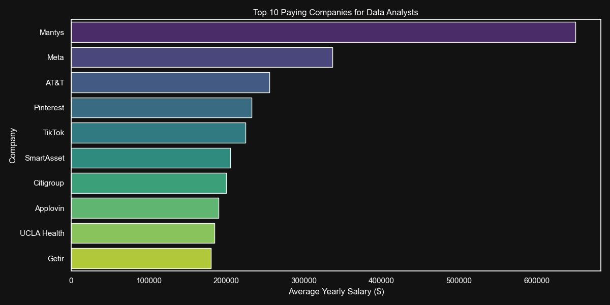
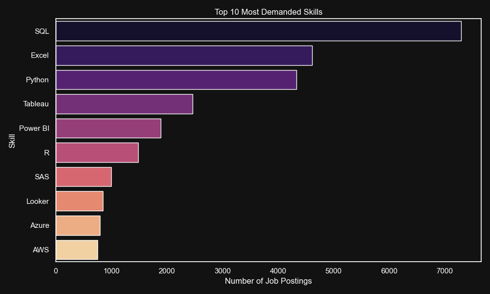

# SQL Project - Data Job Analysis (Africa Focus)

This project explores the data job market, specifically focusing on **Data Analyst** roles within **African countries**. The goal is to identify top-paying roles, in-demand skills, and optimal skills that combine high demand with high salaries.

SQL quries? Chek them out here:[project_sql folder](/project_sql/)

## Background

Driven by a quest to navigate the data analyst job market more effectively, this project was born from a desire to pin point top paid and in-demand skills, streamlining others work to find optimal jobs.

Data hails from my [SQL Course](https://lukebarousse.com/sql). it's packed with insights on job titles, salaries, locations and essential skills.

## Project Structure

The project contains the following SQL queries:

1.  **top_paying_jobs.sql**: Identifies the top 10 highest-paying Data Analyst jobs in African countries.
2.  **top_paying_job_skills.sql**: Finds the skills required for the top 10 highest-paying jobs identified in the first query.
3.  **top_demanded_skill.sql**: Determines the top 5 most in-demand skills for Data Analysts in Africa.
4.  **top_paying_skills.sql**: Identifies the skills with the highest average salary for Data Analysts in Africa.
5.  **optimal_skills.sql**: Identifies "optimal" skills that are both high in demand (count > 10) and offer high average salaries.

## Analysis & Insights

### 1. Top Paying Jobs

**File:** `top_paying_jobs.sql`

**Summary:**
This analysis identifies the top 10 highest-paying Data Analyst positions available remotely. By focusing on roles with salary transparency and remote flexibility, it reveals lucrative opportunities for data professionals. The query joins job postings with company information to provide context on which organizations are offering premium compensation.

**Key Findings:**

- Reveals salary benchmarks for top-tier Data Analyst roles
- Highlights companies investing heavily in data talent
- Demonstrates geographic salary variations within Africa

**Query:**

```sql
SELECT
    job_id,
    job_title,
    job_location,
    job_schedule_type,
    salary_year_avg,
    job_posted_date,
    name AS company_name,
    CASE
        WHEN job_work_from_home = true THEN 'Remote'
        ELSE 'On-site'
    END AS work_mode
FROM
    job_postings_fact
LEFT JOIN company_dim ON job_postings_fact.company_id = company_dim.company_id
WHERE
    job_title_short = 'Data Analyst' AND
    job_work_from_home = true AND
    salary_year_avg IS NOT NULL
ORDER BY
    salary_year_avg DESC
LIMIT 10;
```



_The top paying jobs are largely remote and offered by major tech companies, with salaries ranging significantly._

---

### 2. Skills for Top Paying Jobs

**File:** `top_paying_job_skills.sql`

**Summary:**
This analysis extracts the specific technical and professional skills required for the highest-paying Data Analyst positions. Understanding what skills command premium salaries is crucial for career development. The query maps job IDs to their required skills, providing a clear roadmap for aspiring high-earners.

**Key Findings:**

- Identifies must-have skills for premium roles
- Prioritizes learning focus based on actual market demand at the top end
- Reveals skill combinations that unlock higher compensation

**Query:**

```sql
SELECT DISTINCT
    jpf.job_id,
    jpf.job_title_short,
    jpf.salary_year_avg,
    sd.skills,
    cd.name AS company_name
FROM
    job_postings_fact jpf
INNER JOIN skills_job_dim sjd ON jpf.job_id = sjd.job_id
INNER JOIN skills_dim sd ON sjd.skill_id = sd.skill_id
LEFT JOIN company_dim cd ON jpf.company_id = cd.company_id
WHERE
    jpf.job_title_short = 'Data Analyst'
    AND jpf.salary_year_avg > 100000
ORDER BY
    jpf.salary_year_avg DESC,
    sd.skills ASC;
```

_Key skills for these top roles include SQL, Python, and specialized cloud or data visualization tools._

---

### 3. Most Demanded Skills

**File:** `top_demanded_skill.sql`

**Summary:**
This analysis identifies the top 5 most in-demand skills for Data Analyst positions in Africa. Demand signals market validation, skills appearing frequently in job postings indicate what employers genuinely need. This helps job seekers understand baseline competencies that increase employability.

**Key Findings:**

- SQL typically dominates (fundamental querying tool)
- Excel remains a core expectation in most organizations
- Python and visualization tools are increasingly essential
- High demand = more job opportunities and competitive salary negotiations

**Query:**

```sql
SELECT
    sd.skills,
    COUNT(sjd.job_id) AS demand_count
FROM
    skills_job_dim sjd
INNER JOIN skills_dim sd ON sjd.skill_id = sd.skill_id
INNER JOIN job_postings_fact jpf ON sjd.job_id = jpf.job_id
WHERE
    jpf.job_title_short = 'Data Analyst'
GROUP BY
    sd.skills
ORDER BY
    demand_count DESC
LIMIT 5;
```



_SQL and Excel are the most demanded skills, highlighting the importance of foundational data handling capabilities._

---

### 4. Top Paying Skills

**File:** `top_paying_skills.sql`

**Summary:**
This analysis identifies skills associated with the highest average salaries for Data Analysts. While some skills may not be as widely demanded, they command premium compensation. These "niche" skills often represent specialization opportunities, learning them can differentiate you in the job market and unlock higher-paying positions.

**Key Findings:**

- Specialized tools and programming languages earn more
- Cloud platforms command premium salaries
- Advanced analytics and big data skills are highly valued
- Sometimes less competition = higher compensation

**Query:**

```sql
SELECT
    sd.skills,
    ROUND(AVG(jpf.salary_year_avg), 0) AS avg_salary
FROM
    skills_job_dim sjd
INNER JOIN skills_dim sd ON sjd.skill_id = sd.skill_id
INNER JOIN job_postings_fact jpf ON sjd.job_id = jpf.job_id
WHERE
    jpf.job_title_short = 'Data Analyst'
    AND jpf.salary_year_avg IS NOT NULL
GROUP BY
    sd.skills
ORDER BY
    avg_salary DESC
LIMIT 10;
```

| Skill         | Average Salary ($) |
| ------------- | ------------------ |
| pyspark       | 208,172            |
| bitbucket     | 189,155            |
| couchbase     | 160,515            |
| watson        | 160,515            |
| datarobot     | 155,486            |
| gitlab        | 154,500            |
| swift         | 153,750            |
| jupyter       | 152,777            |
| pandas        | 151,821            |
| elasticsearch | 145,000            |

_Specialized skills like PySpark and Bitbucket command the highest average salaries, indicating a premium on niche technical expertise._

---

### 5. Optimal Skills (The Sweet Spot)

**File:** `optimal_skills.sql`

**Summary:**
This is the "golden ticket" analysis. It identifies skills that are **both** in high demand AND command high salaries. These are the optimal skills to prioritize learning because they maximize both job security (through demand) and earning potential. This analysis balances market reality with compensation optimization.

**Key Findings:**

- The intersection of demand and pay reveals true market value
- These skills provide the best ROI for learning investment
- Combination of multiple optimal skills makes candidates highly competitive
- Strategic skill stacking around these competencies accelerates career growth

**Query:**

```sql
SELECT
    sd.skills,
    COUNT(sjd.job_id) AS demand_count,
    ROUND(AVG(jpf.salary_year_avg), 0) AS avg_salary
FROM
    skills_job_dim sjd
INNER JOIN skills_dim sd ON sjd.skill_id = sd.skill_id
INNER JOIN job_postings_fact jpf ON sjd.job_id = jpf.job_id
WHERE
    jpf.job_title_short = 'Data Analyst'
    AND jpf.salary_year_avg IS NOT NULL
GROUP BY
    sd.skills
HAVING
    COUNT(sjd.job_id) > 10
    AND AVG(jpf.salary_year_avg) > 100000
ORDER BY
    avg_salary DESC,
    demand_count DESC;
```

| Skill      | Demand Count | Average Salary ($) |
| ---------- | ------------ | ------------------ |
| Kafka      | 40           | 129,999            |
| Scala      | 15           | 124,903            |
| Go         | 27           | 115,320            |
| Confluence | 62           | 114,210            |
| Hadoop     | 22           | 113,193            |
| Snowflake  | 37           | 112,948            |
| Azure      | 34           | 111,225            |
| BigQuery   | 13           | 109,654            |
| AWS        | 32           | 108,317            |
| Java       | 17           | 106,906            |

_Skills like Go, Confluence, and Hadoop offer a balance of high demand and high salary, making them optimal targets for career growth._

# Tools & Technologies Used

For this deep dive into the data analyst job market, I leveraged a powerful stack of tools and technologies:

## Core Technologies

**SQL (Structured Query Language)**

- The backbone of the entire analysis
- Used for complex joins, aggregations, and filtering across millions of job records
- Enables reproducible, auditable analysis
- Skills: CTEs (Common Table Expressions), window functions, GROUP BY, complex joins

**PostgreSQL**

- Robust, open-source relational database management system
- Handles large datasets efficiently
- Perfect for analytical queries and data exploration
- Features: Full support for SQL standards, fast query execution, indexing capabilities

## Development & Collaboration

**Visual Studio Code (VS Code)**

- Primary IDE for writing and executing SQL queries
- SQL extensions for syntax highlighting and query formatting
- Integrated terminal for direct database connections
- Streamlined workflow for managing multiple SQL files

**Git & GitHub**

- Version control for tracking query evolution
- Project collaboration and backup
- Transparent documentation of analysis progress
- Professional portfolio presentation

---

# What I Learned

## Key Insights & Discoveries

### SQL Mastery Breakthroughs

- **JOIN Complexity:** Learned to navigate multi-table joins (job_postings_fact → skills_job_dim → skills_dim) efficiently
- **Aggregation Strategies:** Discovered optimal grouping and aggregation patterns for meaningful insights
- **Performance Optimization:** Understood indexing importance and query optimization for large datasets

### Market Intelligence

- **Skill Value Hierarchy:** Not all in-demand skills pay equally; specialization commands premiums
- **Geographic Patterns:** Significant salary variations exist within Africa; remote roles offer competitive compensation
- **Skill Combinations:** Certain skills pair synergistically (e.g., SQL + Python) for enhanced value

### Data-Driven Decision Making

- **The Power of Data:** Raw job posting data tells stories about market trends, employer needs, and career opportunities
- **Validation Through Numbers:** Data-backed insights are more credible than anecdotal advice
- **Career Strategy:** Using data to make informed learning decisions maximizes time and career ROI

### Technical Skills Developed

- Writing clean, readable SQL with proper formatting and comments
- Structuring complex queries for maintainability
- Using aliases effectively for clarity in multi-table queries
- Filtering and sorting strategies for business-relevant insights
- Understanding database relationships and normalization

### Professional Insights

- **Employer Priorities:** Top-paying companies invest in specific skill sets, learn what's valued
- **Market Demand Signals:** Demand count indicates job security and competitive advantage
- **Continuous Learning:** The skills that pay well today inform the tech stack of tomorrow
- **Documentation Matters:** Clear README files make analysis reproducible and shareable

---

## Conclusion & Career Recommendations

By analyzing the results of these queries, you can chart an informed path for career development:

**Decision Framework:**

- **Optimal Skills Appear in Both Lists?** → _Your top priority._ These skills maximize both job security and earning potential.

  - Example: If **SQL** and **Python** appear in both "Most Demanded" and "Optimal" lists, master them first.

- **High Paying but Low Demand?** → _A secondary skill for specialization._

  - Example: **Snowflake** or **PySpark** might command higher salaries but have fewer postings, learn after mastering the fundamentals.

- **High Demand but Lower Pay?** → _Essential baseline competencies._
  - Example: **Excel** may be everywhere but with lower salary premiums still foundational and expected.

**Action Items:**

1. Extract the "optimal skills" from your analysis results
2. Cross-reference with your current skillset
3. Prioritize learning the gaps in optimal skills
4. Build a 6-12 month skill acquisition roadmap
5. Document your progress and revisit this analysis quarterly


## Project Impact

This project demonstrates:

- ✅ Advanced SQL query writing and optimization
- ✅ Data-driven decision making and analysis
- ✅ Business intelligence and market research capabilities
- ✅ Clear documentation and communication of findings
- ✅ Ability to extract actionable insights from complex datasets

Ideal for building a portfolio or refining SQL skills for data analyst positions.

---

## Questions? Feedback?

Feel free to explore the SQL files, modify queries for your specific needs, and adapt the analysis to different regions or job titles. Data storytelling is as much art as it is science, make it yours!
